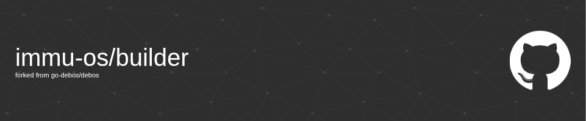

A custom fork of [debos](https://github.com/go-debos/debos), extended to serve as the foundation of our pipeline for building immutable, reproducible Debian/Ubuntu-based OS images.

This project is designed specifically for automated workflows and CI/CD pipelines where image immutability, reproducibility, and advanced customization are required. builder enables us to create minimal, secure, and consistent system images for deployment. Extending debos with new actions and recipe features to support our unique requirements for image composition, export, and validation.

## 🚀 Usage

```sh
debos [options] <recipe file in YAML>
debos [--help]
```


## 🛠️ Added features

### new-filesystem
 Create and mount a filesystem image at any path, with custom options and mountpoints.

```yaml
 action: new-filesystem
    description: "Create a new ext4fs"
    name: {{ $filesystem }}
    path: /tmp/{{ $filesystem }}.img
    size: 2G
    filesystem: ext4
    mountpoint: /mnt/kernelfs
```

### export-filesystem
Export a filesystem image by name or path, with flexible source resolution and trimming.
```yaml
- action: export-filesystem
    description: "Export the filesystem image"
    name: {{ $filesystem }}
    destination: {{ $destination }}
    trim: true
```
</details>


## 🏗️ Build from Source

To build and install this version of debos from source:

1. **Install dependencies** (on Debian/Ubuntu):
   `sudo apt update && sudo apt install -y golang git libglib2.0-dev libostree-dev qemu-system-x86 qemu-user-static debootstrap systemd-container`
2. **Clone this repository:**
   `git clone https://github.com/immu-os/builder builder && cd builder`
3. **Build the debos binary:**
   `go build -o debos ./cmd/debos`
4. **(Optional) Install system-wide:**
   `sudo install -m 755 debos /usr/local/bin/`

You can now run debos using the `debos` command.


## 🔄 Compatibility

- builder is a drop-in replacement for debos, and all standard debos recipes and actions are supported.
- All new actions are fully documented in this README.

## 📝 License

builder is licensed under the Apache 2.0 License. See [LICENSE](LICENSE) for details.

## 🙏 Credits

builder is based on [debos](https://github.com/go-debos/debos) by Collabora Ltd. and contributors, with custom extensions and maintenance by the immu-os team.
